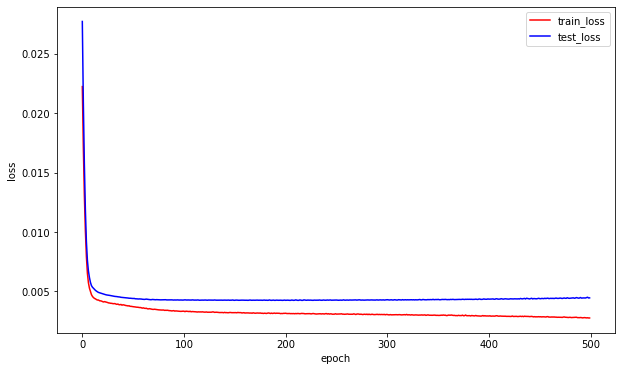
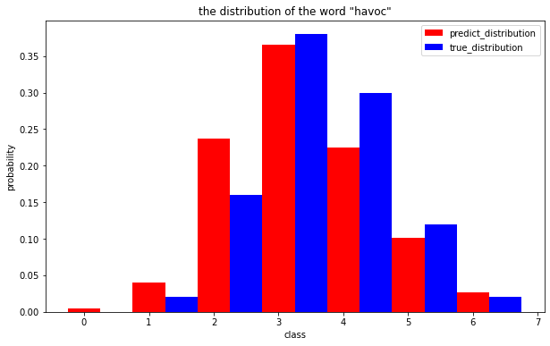
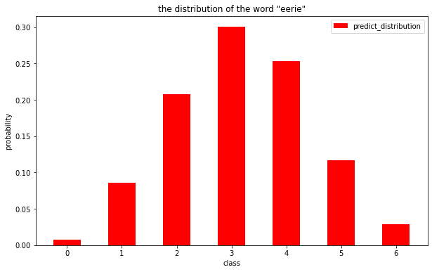
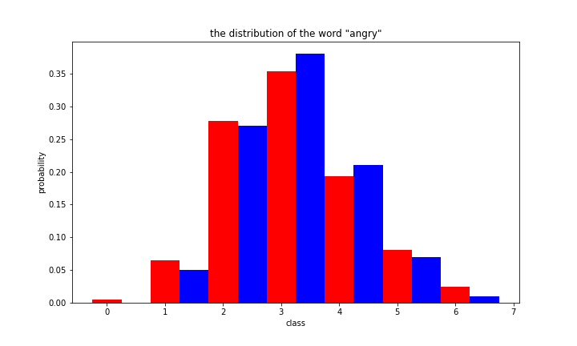
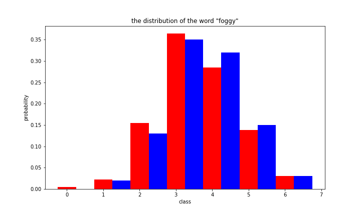
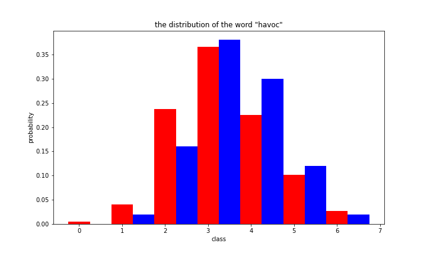
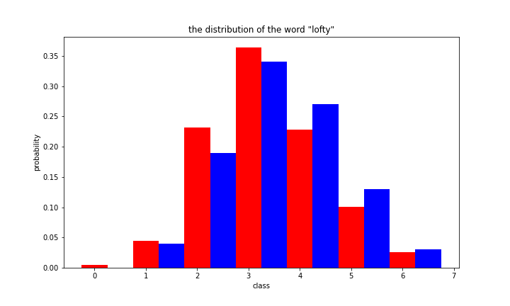
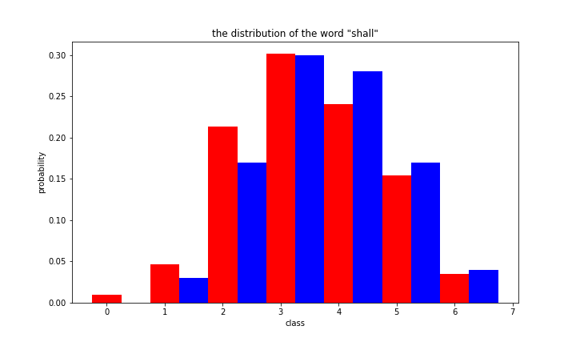
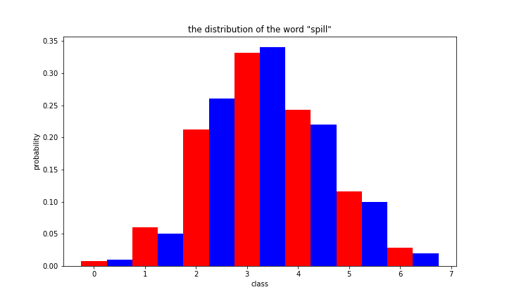
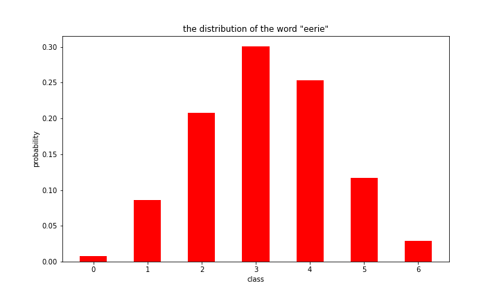

# 对我们提取特征之后的数据重新利用神经网络进行学习

### 介绍

我们在`word_data`提取了一系列的特征，比如senti(情感标签)、cixing(词性)、diversity(词的多义性)、freq(在字典中的词频)、vowel_percentage(包含元音百分比)、if_weekdays(是否工作日)、correation(单词字母相关度),在这些特征之外，我们还加入了月份和日期作为另外的两个维度，通过一共输入维度为9、输出维度为7、两个50维隐含层的神经网络输出最终的分布值，我们将数据划分70%为训练集、剩下30%为测试集，最终在测试集上所得MSE为0.0042,且由图片可以看出预测的分布较为精准。


```python
# 读取word_data.xlsx中的数据，将其转换为特征向量，然后使用简单的神经网络进行分类
import pandas as pd
import numpy as np
import matplotlib.pyplot as plt
import torch
import torch.nn as nn
import torch.nn.functional as F
from torchinfo import summary
from simpleNet import SimpleNet
```

### 加载数据


```python
# 读取数据
data = pd.read_excel('word_data_new.xlsx')
data.head()
```


<div>
<style scoped>
    .dataframe tbody tr th:only-of-type {
        vertical-align: middle;
    }

    .dataframe tbody tr th {
        vertical-align: top;
    }
    
    .dataframe thead th {
        text-align: right;
    }
</style>
<table border="1" class="dataframe">
  <thead>
    <tr style="text-align: right;">
      <th></th>
      <th>Date</th>
      <th>Date.1</th>
      <th>Contest number</th>
      <th>word</th>
      <th>senti</th>
      <th>senti_score</th>
      <th>cixing</th>
      <th>diversity</th>
      <th>freq_1</th>
      <th>freq_2</th>
      <th>vowel_percentage(%)</th>
      <th>if_weekdays</th>
      <th>correlations</th>
      <th>1 try</th>
      <th>2 tries</th>
      <th>3 tries</th>
      <th>4 tries</th>
      <th>5 tries</th>
      <th>6 tries</th>
      <th>7 or more tries (X)</th>
    </tr>
  </thead>
  <tbody>
    <tr>
      <th>0</th>
      <td>2022-12-31</td>
      <td>44926</td>
      <td>560</td>
      <td>manly</td>
      <td>1</td>
      <td>0.0000</td>
      <td>RB</td>
      <td>0.620000</td>
      <td>0.264214</td>
      <td>0.265298</td>
      <td>20.0</td>
      <td>0</td>
      <td>0.343806</td>
      <td>0</td>
      <td>2</td>
      <td>17</td>
      <td>37</td>
      <td>29</td>
      <td>12</td>
      <td>2</td>
    </tr>
    <tr>
      <th>1</th>
      <td>2022-12-30</td>
      <td>44925</td>
      <td>559</td>
      <td>molar</td>
      <td>1</td>
      <td>0.0000</td>
      <td>JJ</td>
      <td>0.777778</td>
      <td>0.329989</td>
      <td>0.315016</td>
      <td>40.0</td>
      <td>1</td>
      <td>0.491583</td>
      <td>0</td>
      <td>4</td>
      <td>21</td>
      <td>38</td>
      <td>26</td>
      <td>9</td>
      <td>1</td>
    </tr>
    <tr>
      <th>2</th>
      <td>2022-12-29</td>
      <td>44924</td>
      <td>558</td>
      <td>havoc</td>
      <td>0</td>
      <td>-0.5994</td>
      <td>NN</td>
      <td>0.001000</td>
      <td>0.254738</td>
      <td>0.237445</td>
      <td>40.0</td>
      <td>1</td>
      <td>0.097901</td>
      <td>0</td>
      <td>2</td>
      <td>16</td>
      <td>38</td>
      <td>30</td>
      <td>12</td>
      <td>2</td>
    </tr>
    <tr>
      <th>3</th>
      <td>2022-12-28</td>
      <td>44923</td>
      <td>557</td>
      <td>impel</td>
      <td>1</td>
      <td>0.0000</td>
      <td>NN</td>
      <td>0.500000</td>
      <td>0.287625</td>
      <td>0.314575</td>
      <td>40.0</td>
      <td>1</td>
      <td>0.187709</td>
      <td>0</td>
      <td>3</td>
      <td>21</td>
      <td>40</td>
      <td>25</td>
      <td>9</td>
      <td>1</td>
    </tr>
    <tr>
      <th>4</th>
      <td>2022-12-27</td>
      <td>44922</td>
      <td>556</td>
      <td>condo</td>
      <td>1</td>
      <td>0.0000</td>
      <td>NN</td>
      <td>0.001000</td>
      <td>0.267001</td>
      <td>0.290084</td>
      <td>40.0</td>
      <td>1</td>
      <td>0.308737</td>
      <td>0</td>
      <td>2</td>
      <td>17</td>
      <td>35</td>
      <td>29</td>
      <td>14</td>
      <td>3</td>
    </tr>
  </tbody>
</table>
</div>


```python
# 列出cixing的所有取值
cixing = data['cixing'].unique()
print(cixing)
```

    ['RB' 'JJ' 'NN' 'IN' 'VBD' 'VB' 'VBN' 'NNS' 'VBP' 'EX' 'NNP' 'VBZ' 'CC'
     'VBG' 'FW' 'RBR' 'JJR' 'MD' 'JJS' 'PRP$' 'DT']


```python
# 将cixing的取值转换为数字
# 先制作一个map ['RB' 'JJ' 'NN' 'IN' 'VBD' 'VB' 'VBN' 'NNS' 'VBP' 'EX' 'NNP' 'VBZ' 'CC' 'VBG' 'FW' 'RBR' 'JJR' 'MD' 'JJS' 'PRP$' 'DT']
cixing_map = {'RB': 0, 'JJ': 1, 'NN': 2, 'IN': 3, 'VBD': 4, 'VB': 5, 'VBN': 6, 'NNS': 7, 'VBP': 8, 'EX': 9, 'NNP': 10, 'VBZ': 11, 'CC': 12, 'VBG': 13, 'FW': 14, 'RBR': 15, 'JJR': 16, 'MD': 17, 'JJS': 18, 'PRP$': 19, 'DT': 20}
data['cixing'] = data['cixing'].map(cixing_map)
print(data['cixing'].unique())

```

    [ 0  1  2  3  4  5  6  7  8  9 10 11 12 13 14 15 16 17 18 19 20]


```python
data.head()
```


<div>
<style scoped>
    .dataframe tbody tr th:only-of-type {
        vertical-align: middle;
    }

    .dataframe tbody tr th {
        vertical-align: top;
    }
    
    .dataframe thead th {
        text-align: right;
    }
</style>
<table border="1" class="dataframe">
  <thead>
    <tr style="text-align: right;">
      <th></th>
      <th>Date</th>
      <th>Date.1</th>
      <th>Contest number</th>
      <th>word</th>
      <th>senti</th>
      <th>senti_score</th>
      <th>cixing</th>
      <th>diversity</th>
      <th>freq_1</th>
      <th>freq_2</th>
      <th>vowel_percentage(%)</th>
      <th>if_weekdays</th>
      <th>correlations</th>
      <th>1 try</th>
      <th>2 tries</th>
      <th>3 tries</th>
      <th>4 tries</th>
      <th>5 tries</th>
      <th>6 tries</th>
      <th>7 or more tries (X)</th>
    </tr>
  </thead>
  <tbody>
    <tr>
      <th>0</th>
      <td>2022-12-31</td>
      <td>44926</td>
      <td>560</td>
      <td>manly</td>
      <td>1</td>
      <td>0.0000</td>
      <td>0</td>
      <td>0.620000</td>
      <td>0.264214</td>
      <td>0.265298</td>
      <td>20.0</td>
      <td>0</td>
      <td>0.343806</td>
      <td>0</td>
      <td>2</td>
      <td>17</td>
      <td>37</td>
      <td>29</td>
      <td>12</td>
      <td>2</td>
    </tr>
    <tr>
      <th>1</th>
      <td>2022-12-30</td>
      <td>44925</td>
      <td>559</td>
      <td>molar</td>
      <td>1</td>
      <td>0.0000</td>
      <td>1</td>
      <td>0.777778</td>
      <td>0.329989</td>
      <td>0.315016</td>
      <td>40.0</td>
      <td>1</td>
      <td>0.491583</td>
      <td>0</td>
      <td>4</td>
      <td>21</td>
      <td>38</td>
      <td>26</td>
      <td>9</td>
      <td>1</td>
    </tr>
    <tr>
      <th>2</th>
      <td>2022-12-29</td>
      <td>44924</td>
      <td>558</td>
      <td>havoc</td>
      <td>0</td>
      <td>-0.5994</td>
      <td>2</td>
      <td>0.001000</td>
      <td>0.254738</td>
      <td>0.237445</td>
      <td>40.0</td>
      <td>1</td>
      <td>0.097901</td>
      <td>0</td>
      <td>2</td>
      <td>16</td>
      <td>38</td>
      <td>30</td>
      <td>12</td>
      <td>2</td>
    </tr>
    <tr>
      <th>3</th>
      <td>2022-12-28</td>
      <td>44923</td>
      <td>557</td>
      <td>impel</td>
      <td>1</td>
      <td>0.0000</td>
      <td>2</td>
      <td>0.500000</td>
      <td>0.287625</td>
      <td>0.314575</td>
      <td>40.0</td>
      <td>1</td>
      <td>0.187709</td>
      <td>0</td>
      <td>3</td>
      <td>21</td>
      <td>40</td>
      <td>25</td>
      <td>9</td>
      <td>1</td>
    </tr>
    <tr>
      <th>4</th>
      <td>2022-12-27</td>
      <td>44922</td>
      <td>556</td>
      <td>condo</td>
      <td>1</td>
      <td>0.0000</td>
      <td>2</td>
      <td>0.001000</td>
      <td>0.267001</td>
      <td>0.290084</td>
      <td>40.0</td>
      <td>1</td>
      <td>0.308737</td>
      <td>0</td>
      <td>2</td>
      <td>17</td>
      <td>35</td>
      <td>29</td>
      <td>14</td>
      <td>3</td>
    </tr>
  </tbody>
</table>
</div>


```python
# 删除不需要的列 senti_score, freq_1
data = data.drop(['senti_score', 'freq_1','Date.1'], axis=1)
```


```python
data.head()
```


<div>
<style scoped>
    .dataframe tbody tr th:only-of-type {
        vertical-align: middle;
    }

    .dataframe tbody tr th {
        vertical-align: top;
    }
    
    .dataframe thead th {
        text-align: right;
    }
</style>
<table border="1" class="dataframe">
  <thead>
    <tr style="text-align: right;">
      <th></th>
      <th>Date</th>
      <th>Contest number</th>
      <th>word</th>
      <th>senti</th>
      <th>cixing</th>
      <th>diversity</th>
      <th>freq_2</th>
      <th>vowel_percentage(%)</th>
      <th>if_weekdays</th>
      <th>correlations</th>
      <th>1 try</th>
      <th>2 tries</th>
      <th>3 tries</th>
      <th>4 tries</th>
      <th>5 tries</th>
      <th>6 tries</th>
      <th>7 or more tries (X)</th>
    </tr>
  </thead>
  <tbody>
    <tr>
      <th>0</th>
      <td>2022-12-31</td>
      <td>560</td>
      <td>manly</td>
      <td>1</td>
      <td>0</td>
      <td>0.620000</td>
      <td>0.265298</td>
      <td>20.0</td>
      <td>0</td>
      <td>0.343806</td>
      <td>0</td>
      <td>2</td>
      <td>17</td>
      <td>37</td>
      <td>29</td>
      <td>12</td>
      <td>2</td>
    </tr>
    <tr>
      <th>1</th>
      <td>2022-12-30</td>
      <td>559</td>
      <td>molar</td>
      <td>1</td>
      <td>1</td>
      <td>0.777778</td>
      <td>0.315016</td>
      <td>40.0</td>
      <td>1</td>
      <td>0.491583</td>
      <td>0</td>
      <td>4</td>
      <td>21</td>
      <td>38</td>
      <td>26</td>
      <td>9</td>
      <td>1</td>
    </tr>
    <tr>
      <th>2</th>
      <td>2022-12-29</td>
      <td>558</td>
      <td>havoc</td>
      <td>0</td>
      <td>2</td>
      <td>0.001000</td>
      <td>0.237445</td>
      <td>40.0</td>
      <td>1</td>
      <td>0.097901</td>
      <td>0</td>
      <td>2</td>
      <td>16</td>
      <td>38</td>
      <td>30</td>
      <td>12</td>
      <td>2</td>
    </tr>
    <tr>
      <th>3</th>
      <td>2022-12-28</td>
      <td>557</td>
      <td>impel</td>
      <td>1</td>
      <td>2</td>
      <td>0.500000</td>
      <td>0.314575</td>
      <td>40.0</td>
      <td>1</td>
      <td>0.187709</td>
      <td>0</td>
      <td>3</td>
      <td>21</td>
      <td>40</td>
      <td>25</td>
      <td>9</td>
      <td>1</td>
    </tr>
    <tr>
      <th>4</th>
      <td>2022-12-27</td>
      <td>556</td>
      <td>condo</td>
      <td>1</td>
      <td>2</td>
      <td>0.001000</td>
      <td>0.290084</td>
      <td>40.0</td>
      <td>1</td>
      <td>0.308737</td>
      <td>0</td>
      <td>2</td>
      <td>17</td>
      <td>35</td>
      <td>29</td>
      <td>14</td>
      <td>3</td>
    </tr>
  </tbody>
</table>
</div>


```python
# 构造输入输出数据
data_features = data.iloc[:,[0,3,4,5,6,7,8,9]]
data_distribution = data.iloc[:,10:]
```


```python
data_features.head()
```


<div>
<style scoped>
    .dataframe tbody tr th:only-of-type {
        vertical-align: middle;
    }

    .dataframe tbody tr th {
        vertical-align: top;
    }
    
    .dataframe thead th {
        text-align: right;
    }
</style>
<table border="1" class="dataframe">
  <thead>
    <tr style="text-align: right;">
      <th></th>
      <th>Date</th>
      <th>senti</th>
      <th>cixing</th>
      <th>diversity</th>
      <th>freq_2</th>
      <th>vowel_percentage(%)</th>
      <th>if_weekdays</th>
      <th>correlations</th>
    </tr>
  </thead>
  <tbody>
    <tr>
      <th>0</th>
      <td>2022-12-31</td>
      <td>1</td>
      <td>0</td>
      <td>0.620000</td>
      <td>0.265298</td>
      <td>20.0</td>
      <td>0</td>
      <td>0.343806</td>
    </tr>
    <tr>
      <th>1</th>
      <td>2022-12-30</td>
      <td>1</td>
      <td>1</td>
      <td>0.777778</td>
      <td>0.315016</td>
      <td>40.0</td>
      <td>1</td>
      <td>0.491583</td>
    </tr>
    <tr>
      <th>2</th>
      <td>2022-12-29</td>
      <td>0</td>
      <td>2</td>
      <td>0.001000</td>
      <td>0.237445</td>
      <td>40.0</td>
      <td>1</td>
      <td>0.097901</td>
    </tr>
    <tr>
      <th>3</th>
      <td>2022-12-28</td>
      <td>1</td>
      <td>2</td>
      <td>0.500000</td>
      <td>0.314575</td>
      <td>40.0</td>
      <td>1</td>
      <td>0.187709</td>
    </tr>
    <tr>
      <th>4</th>
      <td>2022-12-27</td>
      <td>1</td>
      <td>2</td>
      <td>0.001000</td>
      <td>0.290084</td>
      <td>40.0</td>
      <td>1</td>
      <td>0.308737</td>
    </tr>
  </tbody>
</table>
</div>


```python
data_distribution.head()
```


<div>
<style scoped>
    .dataframe tbody tr th:only-of-type {
        vertical-align: middle;
    }

    .dataframe tbody tr th {
        vertical-align: top;
    }
    
    .dataframe thead th {
        text-align: right;
    }
</style>
<table border="1" class="dataframe">
  <thead>
    <tr style="text-align: right;">
      <th></th>
      <th>1 try</th>
      <th>2 tries</th>
      <th>3 tries</th>
      <th>4 tries</th>
      <th>5 tries</th>
      <th>6 tries</th>
      <th>7 or more tries (X)</th>
    </tr>
  </thead>
  <tbody>
    <tr>
      <th>0</th>
      <td>0</td>
      <td>2</td>
      <td>17</td>
      <td>37</td>
      <td>29</td>
      <td>12</td>
      <td>2</td>
    </tr>
    <tr>
      <th>1</th>
      <td>0</td>
      <td>4</td>
      <td>21</td>
      <td>38</td>
      <td>26</td>
      <td>9</td>
      <td>1</td>
    </tr>
    <tr>
      <th>2</th>
      <td>0</td>
      <td>2</td>
      <td>16</td>
      <td>38</td>
      <td>30</td>
      <td>12</td>
      <td>2</td>
    </tr>
    <tr>
      <th>3</th>
      <td>0</td>
      <td>3</td>
      <td>21</td>
      <td>40</td>
      <td>25</td>
      <td>9</td>
      <td>1</td>
    </tr>
    <tr>
      <th>4</th>
      <td>0</td>
      <td>2</td>
      <td>17</td>
      <td>35</td>
      <td>29</td>
      <td>14</td>
      <td>3</td>
    </tr>
  </tbody>
</table>
</div>


### 删除一些feature


```python
# 删除不需要的列
# data_features = data_features.drop(['cixing','senti'], axis=1)
data_features.head()
```


<div>
<style scoped>
    .dataframe tbody tr th:only-of-type {
        vertical-align: middle;
    }

    .dataframe tbody tr th {
        vertical-align: top;
    }
    
    .dataframe thead th {
        text-align: right;
    }
</style>
<table border="1" class="dataframe">
  <thead>
    <tr style="text-align: right;">
      <th></th>
      <th>Date</th>
      <th>senti</th>
      <th>cixing</th>
      <th>diversity</th>
      <th>freq_2</th>
      <th>vowel_percentage(%)</th>
      <th>if_weekdays</th>
      <th>correlations</th>
    </tr>
  </thead>
  <tbody>
    <tr>
      <th>0</th>
      <td>2022-12-31</td>
      <td>1</td>
      <td>0</td>
      <td>0.620000</td>
      <td>0.265298</td>
      <td>20.0</td>
      <td>0</td>
      <td>0.343806</td>
    </tr>
    <tr>
      <th>1</th>
      <td>2022-12-30</td>
      <td>1</td>
      <td>1</td>
      <td>0.777778</td>
      <td>0.315016</td>
      <td>40.0</td>
      <td>1</td>
      <td>0.491583</td>
    </tr>
    <tr>
      <th>2</th>
      <td>2022-12-29</td>
      <td>0</td>
      <td>2</td>
      <td>0.001000</td>
      <td>0.237445</td>
      <td>40.0</td>
      <td>1</td>
      <td>0.097901</td>
    </tr>
    <tr>
      <th>3</th>
      <td>2022-12-28</td>
      <td>1</td>
      <td>2</td>
      <td>0.500000</td>
      <td>0.314575</td>
      <td>40.0</td>
      <td>1</td>
      <td>0.187709</td>
    </tr>
    <tr>
      <th>4</th>
      <td>2022-12-27</td>
      <td>1</td>
      <td>2</td>
      <td>0.001000</td>
      <td>0.290084</td>
      <td>40.0</td>
      <td>1</td>
      <td>0.308737</td>
    </tr>
  </tbody>
</table>
</div>


### 转换数据


```python
# 将data_features第一列数据分成两列 即将Date列分成月和日两列
data_features['Month'] = data_features['Date'].apply(lambda x: x.month)
data_features['Day'] = data_features['Date'].apply(lambda x: x.day)
data_features = data_features.drop(['Date'], axis=1)
data_features.head()
```

    C:\Users\dongl\AppData\Local\Temp/ipykernel_24168/1307404672.py:2: SettingWithCopyWarning: 
    A value is trying to be set on a copy of a slice from a DataFrame.
    Try using .loc[row_indexer,col_indexer] = value instead
    
    See the caveats in the documentation: https://pandas.pydata.org/pandas-docs/stable/user_guide/indexing.html#returning-a-view-versus-a-copy
      data_features['Month'] = data_features['Date'].apply(lambda x: x.month)
    C:\Users\dongl\AppData\Local\Temp/ipykernel_24168/1307404672.py:3: SettingWithCopyWarning: 
    A value is trying to be set on a copy of a slice from a DataFrame.
    Try using .loc[row_indexer,col_indexer] = value instead
    
    See the caveats in the documentation: https://pandas.pydata.org/pandas-docs/stable/user_guide/indexing.html#returning-a-view-versus-a-copy
      data_features['Day'] = data_features['Date'].apply(lambda x: x.day)


<div>
<style scoped>
    .dataframe tbody tr th:only-of-type {
        vertical-align: middle;
    }

    .dataframe tbody tr th {
        vertical-align: top;
    }
    
    .dataframe thead th {
        text-align: right;
    }
</style>
<table border="1" class="dataframe">
  <thead>
    <tr style="text-align: right;">
      <th></th>
      <th>senti</th>
      <th>cixing</th>
      <th>diversity</th>
      <th>freq_2</th>
      <th>vowel_percentage(%)</th>
      <th>if_weekdays</th>
      <th>correlations</th>
      <th>Month</th>
      <th>Day</th>
    </tr>
  </thead>
  <tbody>
    <tr>
      <th>0</th>
      <td>1</td>
      <td>0</td>
      <td>0.620000</td>
      <td>0.265298</td>
      <td>20.0</td>
      <td>0</td>
      <td>0.343806</td>
      <td>12</td>
      <td>31</td>
    </tr>
    <tr>
      <th>1</th>
      <td>1</td>
      <td>1</td>
      <td>0.777778</td>
      <td>0.315016</td>
      <td>40.0</td>
      <td>1</td>
      <td>0.491583</td>
      <td>12</td>
      <td>30</td>
    </tr>
    <tr>
      <th>2</th>
      <td>0</td>
      <td>2</td>
      <td>0.001000</td>
      <td>0.237445</td>
      <td>40.0</td>
      <td>1</td>
      <td>0.097901</td>
      <td>12</td>
      <td>29</td>
    </tr>
    <tr>
      <th>3</th>
      <td>1</td>
      <td>2</td>
      <td>0.500000</td>
      <td>0.314575</td>
      <td>40.0</td>
      <td>1</td>
      <td>0.187709</td>
      <td>12</td>
      <td>28</td>
    </tr>
    <tr>
      <th>4</th>
      <td>1</td>
      <td>2</td>
      <td>0.001000</td>
      <td>0.290084</td>
      <td>40.0</td>
      <td>1</td>
      <td>0.308737</td>
      <td>12</td>
      <td>27</td>
    </tr>
  </tbody>
</table>
</div>


```python
# 转换数据格式
data_features_np = data_features.values
data_distribution_np = data_distribution.values
print('data_features_np.shape = ', data_features_np.shape)
print('data_features_np[:5,:] = \n', data_features_np[:5,:])
print('data_distribution_np.shape = ', data_distribution_np.shape)
print('data_distribution_np[:5,:] = \n', data_distribution_np[:5,:])
```

    data_features_np.shape =  (359, 9)
    data_features_np[:5,:] = 
     [[1.00000000e+00 0.00000000e+00 6.20000000e-01 2.65297965e-01
      2.00000000e+01 0.00000000e+00 3.43805514e-01 1.20000000e+01
      3.10000000e+01]
     [1.00000000e+00 1.00000000e+00 7.77777778e-01 3.15016189e-01
      4.00000000e+01 1.00000000e+00 4.91582513e-01 1.20000000e+01
      3.00000000e+01]
     [0.00000000e+00 2.00000000e+00 1.00000000e-03 2.37445032e-01
      4.00000000e+01 1.00000000e+00 9.79006807e-02 1.20000000e+01
      2.90000000e+01]
     [1.00000000e+00 2.00000000e+00 5.00000000e-01 3.14574926e-01
      4.00000000e+01 1.00000000e+00 1.87708873e-01 1.20000000e+01
      2.80000000e+01]
     [1.00000000e+00 2.00000000e+00 1.00000000e-03 2.90084013e-01
      4.00000000e+01 1.00000000e+00 3.08737246e-01 1.20000000e+01
      2.70000000e+01]]
    data_distribution_np.shape =  (359, 7)
    data_distribution_np[:5,:] = 
     [[ 0  2 17 37 29 12  2]
     [ 0  4 21 38 26  9  1]
     [ 0  2 16 38 30 12  2]
     [ 0  3 21 40 25  9  1]
     [ 0  2 17 35 29 14  3]]


```python
# 做数据处理
# 对data_features_np进行normalization
features_mean = np.mean(data_features_np, axis=0)
features_std = np.std(data_features_np, axis=0)
data_features_np_norm = (data_features_np - features_mean) / features_std
# 将data_distribution_np中的数据转换为概率分布
data_distribution_np = data_distribution_np / 100
print('data_features_np_norm[:5,:] = \n', data_features_np_norm[:5,:])
print('data_distribution_np[:5,:] = \n', data_distribution_np[:5,:])
```

    data_features_np_norm[:5,:] = 
     [[ 0.06666118 -0.86473559  0.30348369 -0.51696379 -1.27981959 -1.57652685
      -0.04498888  1.58231754  1.72832776]
     [ 0.06666118 -0.55827944  0.8165452   0.36174245  0.34561166  0.63430572
       0.41264337  1.58231754  1.61368074]
     [-2.59237924 -0.25182329 -1.70937944 -1.0092289   0.34561166  0.63430572
      -0.80650105  1.58231754  1.49903372]
     [ 0.06666118 -0.25182329 -0.0867321   0.35394368  0.34561166  0.63430572
      -0.52838521  1.58231754  1.3843867 ]
     [ 0.06666118 -0.25182329 -1.70937944 -0.07890199  0.34561166  0.63430572
      -0.15358745  1.58231754  1.26973968]]
    data_distribution_np[:5,:] = 
     [[0.   0.02 0.17 0.37 0.29 0.12 0.02]
     [0.   0.04 0.21 0.38 0.26 0.09 0.01]
     [0.   0.02 0.16 0.38 0.3  0.12 0.02]
     [0.   0.03 0.21 0.4  0.25 0.09 0.01]
     [0.   0.02 0.17 0.35 0.29 0.14 0.03]]


### 划分数据集


```python
# 将数据转换为tensor，并用device指定运行的设备
device = torch.device('cuda' if torch.cuda.is_available() else 'cpu')
print('device = ', device)
data_features_tensor = torch.tensor(data_features_np_norm, dtype=torch.float32, device=device)
data_distribution_tensor = torch.tensor(data_distribution_np, dtype=torch.float32, device=device)
```

    device =  cpu


```python
print('data_features_tensor.shape = ', data_features_tensor.shape)
print('data_features_tensor[:5,:] = \n', data_features_tensor[:5,:])
print('data_distribution_tensor.shape = ', data_distribution_tensor.shape)
print('data_distribution_tensor[:5,:] = \n', data_distribution_tensor[:5,:])
```

    data_features_tensor.shape =  torch.Size([359, 9])
    data_features_tensor[:5,:] = 
     tensor([[ 0.0667, -0.8647,  0.3035, -0.5170, -1.2798, -1.5765, -0.0450,  1.5823,
              1.7283],
            [ 0.0667, -0.5583,  0.8165,  0.3617,  0.3456,  0.6343,  0.4126,  1.5823,
              1.6137],
            [-2.5924, -0.2518, -1.7094, -1.0092,  0.3456,  0.6343, -0.8065,  1.5823,
              1.4990],
            [ 0.0667, -0.2518, -0.0867,  0.3539,  0.3456,  0.6343, -0.5284,  1.5823,
              1.3844],
            [ 0.0667, -0.2518, -1.7094, -0.0789,  0.3456,  0.6343, -0.1536,  1.5823,
              1.2697]])
    data_distribution_tensor.shape =  torch.Size([359, 7])
    data_distribution_tensor[:5,:] = 
     tensor([[0.0000, 0.0200, 0.1700, 0.3700, 0.2900, 0.1200, 0.0200],
            [0.0000, 0.0400, 0.2100, 0.3800, 0.2600, 0.0900, 0.0100],
            [0.0000, 0.0200, 0.1600, 0.3800, 0.3000, 0.1200, 0.0200],
            [0.0000, 0.0300, 0.2100, 0.4000, 0.2500, 0.0900, 0.0100],
            [0.0000, 0.0200, 0.1700, 0.3500, 0.2900, 0.1400, 0.0300]])


```python
# 划分训练集和测试集
train_size = int(0.7 * data_features_tensor.shape[0])
print('train_size = ', train_size)
```

    train_size =  251


```python
# 先将数据打乱
indices = torch.randperm(data_features_tensor.shape[0])
data_features_tensor = data_features_tensor[indices]
data_distribution_tensor = data_distribution_tensor[indices]
```


```python
test_indices = indices[train_size:]
test_indices = test_indices.cpu().numpy()
```


```python
# 划分训练集和测试集
train_features = data_features_tensor[:train_size,:]
train_distribution = data_distribution_tensor[:train_size,:]
test_features = data_features_tensor[train_size:,:]
test_distribution = data_distribution_tensor[train_size:,:]

print('train_features.shape = ', train_features.shape)
print('train_distribution.shape = ', train_distribution.shape)
print('test_features.shape = ', test_features.shape)
print('test_distribution.shape = ', test_distribution.shape)

```

    train_features.shape =  torch.Size([251, 9])
    train_distribution.shape =  torch.Size([251, 7])
    test_features.shape =  torch.Size([108, 9])
    test_distribution.shape =  torch.Size([108, 7])


```python
# 制作dataloader
batch_size = 64
train_dataset = torch.utils.data.TensorDataset(train_features, train_distribution)
test_dataset = torch.utils.data.TensorDataset(test_features, test_distribution)
train_loader = torch.utils.data.DataLoader(train_dataset, batch_size=batch_size, shuffle=True)
test_loader = torch.utils.data.DataLoader(test_dataset, batch_size=batch_size, shuffle=False)
```

### 网络参数


```python
inp_dim = 9
hidden_dim = 50
out_dim = 7
```


```python
net = SimpleNet(inp_dim, hidden_dim, out_dim).to(device)
```


```python
summary(net, (batch_size,inp_dim))
```


    ==========================================================================================
    Layer (type:depth-idx)                   Output Shape              Param #
    ==========================================================================================
    SimpleNet                                [64, 7]                   --
    ├─Linear: 1-1                            [64, 50]                  500
    ├─Linear: 1-2                            [64, 50]                  2,550
    ├─Linear: 1-3                            [64, 7]                   357
    ├─Softmax: 1-4                           [64, 7]                   --
    ==========================================================================================
    Total params: 3,407
    Trainable params: 3,407
    Non-trainable params: 0
    Total mult-adds (M): 0.22
    ==========================================================================================
    Input size (MB): 0.00
    Forward/backward pass size (MB): 0.05
    Params size (MB): 0.01
    Estimated Total Size (MB): 0.07
    ==========================================================================================


```python
criterion = nn.MSELoss()
optimizer = torch.optim.Adam(net.parameters(), lr=0.001)
```

### 开始训练


```python
# 训练
# optimizer = torch.optim.SGD(net.parameters(), lr=1e-7)
# optimizer = torch.optim.Adam(net.parameters(), lr=1e-4)
num_epochs = 500
train_loss_list = []
test_loss_list = []
for epoch in range(num_epochs):
    train_loss = 0
    test_loss = 0
    net.train()
    for i, (features, distribution) in enumerate(train_loader):
        optimizer.zero_grad()
        output = net(features)
        loss = criterion(output, distribution)
        loss.backward()
        optimizer.step()
        train_loss += loss.item()
    train_loss = train_loss / i
    train_loss_list.append(train_loss)
    net.eval()
    with torch.no_grad():
        for i, (features, distribution) in enumerate(test_loader):
            output = net(features)
            loss = criterion(output, distribution)
            test_loss += loss.item()
    test_loss = test_loss / i
    test_loss_list.append(test_loss)
    if epoch % 10 == 0:
        print('epoch = %d, train_loss = %.4f, test_loss = %.4f' % (epoch, train_loss, test_loss))
```

    epoch = 0, train_loss = 0.0222, test_loss = 0.0277
    epoch = 10, train_loss = 0.0046, test_loss = 0.0053
    epoch = 20, train_loss = 0.0041, test_loss = 0.0048
    epoch = 30, train_loss = 0.0040, test_loss = 0.0046
    epoch = 40, train_loss = 0.0039, test_loss = 0.0045
    epoch = 50, train_loss = 0.0037, test_loss = 0.0044
    epoch = 60, train_loss = 0.0036, test_loss = 0.0043
    epoch = 70, train_loss = 0.0035, test_loss = 0.0043
    epoch = 80, train_loss = 0.0034, test_loss = 0.0043
    epoch = 90, train_loss = 0.0034, test_loss = 0.0043
    epoch = 100, train_loss = 0.0033, test_loss = 0.0043
    epoch = 110, train_loss = 0.0033, test_loss = 0.0043
    epoch = 120, train_loss = 0.0033, test_loss = 0.0043
    epoch = 130, train_loss = 0.0032, test_loss = 0.0043
    epoch = 140, train_loss = 0.0032, test_loss = 0.0043
    epoch = 150, train_loss = 0.0032, test_loss = 0.0042
    epoch = 160, train_loss = 0.0032, test_loss = 0.0043
    epoch = 170, train_loss = 0.0032, test_loss = 0.0043
    epoch = 180, train_loss = 0.0032, test_loss = 0.0043
    epoch = 190, train_loss = 0.0031, test_loss = 0.0042
    epoch = 200, train_loss = 0.0032, test_loss = 0.0042
    epoch = 210, train_loss = 0.0031, test_loss = 0.0043
    epoch = 220, train_loss = 0.0031, test_loss = 0.0043
    epoch = 230, train_loss = 0.0031, test_loss = 0.0043
    epoch = 240, train_loss = 0.0031, test_loss = 0.0043
    epoch = 250, train_loss = 0.0031, test_loss = 0.0043
    epoch = 260, train_loss = 0.0031, test_loss = 0.0043
    epoch = 270, train_loss = 0.0031, test_loss = 0.0043
    epoch = 280, train_loss = 0.0031, test_loss = 0.0043
    epoch = 290, train_loss = 0.0031, test_loss = 0.0043
    epoch = 300, train_loss = 0.0031, test_loss = 0.0043
    epoch = 310, train_loss = 0.0030, test_loss = 0.0043
    epoch = 320, train_loss = 0.0030, test_loss = 0.0043
    epoch = 330, train_loss = 0.0030, test_loss = 0.0043
    epoch = 340, train_loss = 0.0030, test_loss = 0.0043
    epoch = 350, train_loss = 0.0030, test_loss = 0.0043
    epoch = 360, train_loss = 0.0030, test_loss = 0.0043
    epoch = 370, train_loss = 0.0030, test_loss = 0.0043
    epoch = 380, train_loss = 0.0030, test_loss = 0.0043
    epoch = 390, train_loss = 0.0029, test_loss = 0.0044
    epoch = 400, train_loss = 0.0029, test_loss = 0.0043
    epoch = 410, train_loss = 0.0029, test_loss = 0.0043
    epoch = 420, train_loss = 0.0029, test_loss = 0.0044
    epoch = 430, train_loss = 0.0029, test_loss = 0.0044
    epoch = 440, train_loss = 0.0029, test_loss = 0.0044
    epoch = 450, train_loss = 0.0029, test_loss = 0.0044
    epoch = 460, train_loss = 0.0028, test_loss = 0.0044
    epoch = 470, train_loss = 0.0028, test_loss = 0.0044
    epoch = 480, train_loss = 0.0028, test_loss = 0.0044
    epoch = 490, train_loss = 0.0028, test_loss = 0.0045


### 训练过程loss-epoch曲线


```python
# 画图
plt.figure(figsize=(10, 6))
plt.plot(train_loss_list, label='train_loss', color='r')
plt.plot(test_loss_list, label='test_loss', color='b')
plt.xlabel('epoch')
plt.ylabel('loss')
plt.legend()
plt.show()
```


​    

​    


### 保存模型


```python
# 保存模型
# torch.save(net.state_dict(), 'model_useFeatures.pth')
```

### 加载模型与评估


```python
# # 加载模型
# device = torch.device('cuda' if torch.cuda.is_available() else 'cpu')
# net = SimpleNet(inp_dim, hidden_dim, out_dim).to(device)
# net.load_state_dict(torch.load('model_useFeatures.pth'))
```


```python
# 从test_features中随机抽取一个样本
```


```python
idx = np.random.randint(0, test_features.shape[0])
random_feature = test_features[idx,:]
# 找出该样本对应的单词
right_idx = test_indices[idx]
word = data['word'][right_idx]
# 推理
net.eval()
with torch.no_grad():
    output = net(test_features[idx,:].unsqueeze(0))
    output_np = output.cpu().numpy()
    print('output_np = \n', output_np)
    print('test_distribution_np[idx,:] = \n', test_distribution[idx,:].cpu().numpy())
    # 画图
    plt.figure(figsize=(10, 6))
    plt.bar(np.arange(7), output_np[0], width=0.5, label='predict_distribution', color='r')
    plt.bar(np.arange(7)+0.5,  test_distribution[idx,:].cpu().numpy() , width=0.5, label='true_distribution', color='b')
    plt.xlabel('class')
    plt.ylabel('probability')
    plt.title('the distribution of the word "{}"'.format(word))
    plt.savefig('distribution_of_{}.png'.format(word))
    plt.legend()
    plt.show()
```

    output_np = 
     [[0.00492735 0.03992923 0.23680885 0.36537868 0.22463727 0.10132587
      0.02699264]]
    test_distribution_np[idx,:] = 
     [0.   0.02 0.16 0.38 0.3  0.12 0.02]



    


```python

```

#### 单词eerie的分布

<!-- 表格 -->

| word | date | if_weekday | senti | cixing | diversity | freq        | vowel percentage(%) | correlations       |
|:-----|:-----|:-----------|:------|:-------|:----------|:------------|:--------------------|:-------------------|
| eerie| 0    | 0/1        | 1     | NN(2)  | 0.444444  | 0.482179277 | 80                  | 1.4018470349381116 |


```python
data_features.head()
```


<div>
<style scoped>
    .dataframe tbody tr th:only-of-type {
        vertical-align: middle;
    }

    .dataframe tbody tr th {
        vertical-align: top;
    }
    
    .dataframe thead th {
        text-align: right;
    }
</style>
<table border="1" class="dataframe">
  <thead>
    <tr style="text-align: right;">
      <th></th>
      <th>senti</th>
      <th>cixing</th>
      <th>diversity</th>
      <th>freq_2</th>
      <th>vowel_percentage(%)</th>
      <th>if_weekdays</th>
      <th>correlations</th>
      <th>Month</th>
      <th>Day</th>
    </tr>
  </thead>
  <tbody>
    <tr>
      <th>0</th>
      <td>1</td>
      <td>0</td>
      <td>0.620000</td>
      <td>0.265298</td>
      <td>20.0</td>
      <td>0</td>
      <td>0.343806</td>
      <td>12</td>
      <td>31</td>
    </tr>
    <tr>
      <th>1</th>
      <td>1</td>
      <td>1</td>
      <td>0.777778</td>
      <td>0.315016</td>
      <td>40.0</td>
      <td>1</td>
      <td>0.491583</td>
      <td>12</td>
      <td>30</td>
    </tr>
    <tr>
      <th>2</th>
      <td>0</td>
      <td>2</td>
      <td>0.001000</td>
      <td>0.237445</td>
      <td>40.0</td>
      <td>1</td>
      <td>0.097901</td>
      <td>12</td>
      <td>29</td>
    </tr>
    <tr>
      <th>3</th>
      <td>1</td>
      <td>2</td>
      <td>0.500000</td>
      <td>0.314575</td>
      <td>40.0</td>
      <td>1</td>
      <td>0.187709</td>
      <td>12</td>
      <td>28</td>
    </tr>
    <tr>
      <th>4</th>
      <td>1</td>
      <td>2</td>
      <td>0.001000</td>
      <td>0.290084</td>
      <td>40.0</td>
      <td>1</td>
      <td>0.308737</td>
      <td>12</td>
      <td>27</td>
    </tr>
  </tbody>
</table>
</div>


```python
# data_eerie_np = np.array([1,0.4444444,0.482179277,80,0,1.4018470349381116]) # 删掉了cixing
# data_eerie_np = np.array([0.4444444,0.482179277,80,0,1.4018470349381116]) # 删掉了cixing 和 senti
data_eerie_np = np.array([1, 2, 0.4444444,0.482179277,80,0,1.4018470349381116,3,1])
```


```python
# 将数据转换为tensor，并用device指定运行的设备
data_eerie_np = (data_eerie_np - features_mean) / features_std
data_eerie_tensor = torch.tensor(data_eerie_np, dtype=torch.float32, device=device)
```


```python

# 推理
net.eval()
with torch.no_grad():
    output = net(data_eerie_tensor.unsqueeze(0))
    output_np = output.cpu().numpy()
    print('output_np = \n', output_np)
    # 画图
    plt.figure(figsize=(10, 6))
    plt.bar(np.arange(7), output_np[0], width=0.5, label='predict_distribution', color='r')
    plt.xlabel('class')
    plt.ylabel('probability')
    plt.title('the distribution of the word "{}"'.format('eerie'))
    plt.savefig('distribution_of_{}.png'.format('eerie'))
    plt.legend()
    plt.show()
```

    output_np = 
     [[0.00751348 0.08591553 0.20796828 0.3003361  0.25300962 0.1165532
      0.02870386]]



    


### 结果展示

下面是最优的模型的结果展示，可以看到，模型的预测结果和真实结果的分布相差不大，说明模型的效果还是不错的。

<!-- html -->

<div class="row">
    <div class="column">
        
        
        
        
        
        
    </div>
</div>


最后我们对3月1日`eerie`单词的分布预测为：




